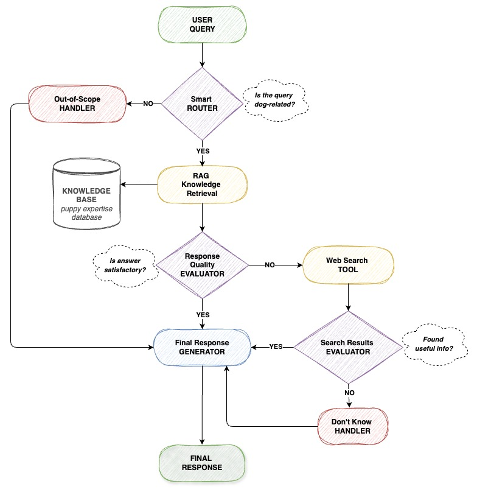

# 🐶 PuppyCompanion
### AI-Powered Puppy Care Assistant

*Transform overwhelming puppy parenthood into confident, informed care decisions*

---

### **The Problem**
New puppy owners face overwhelming decisions daily: *"Is this behavior normal? What should I feed my puppy? How do I stop the biting?"* 

### **The Solution** 
PuppyCompanion combines **expert veterinary knowledge** with **real-time web intelligence** to provide instant, reliable guidance when you need it most.

## Architecture - Under the Hood

### 🔬 **Intelligent Decision Engine**

PuppyCompanion employs a **5-stage intelligent workflow** that mimics how expert veterinarians approach puppy care questions:

<strong>🔍 Stage 1: Smart Query Routing</strong>

**What happens:** Advanced NLP classification determines if your question relates to puppy care
- ✅ **Dog-related query** → Proceeds to knowledge retrieval
- ❌ **Off-topic query** → Politely redirects with helpful suggestions

**Example:** *"How do I house train my puppy?"* ✅ vs *"What's the weather today?"* ❌

<strong>📚 Stage 2: Expert Knowledge Retrieval (RAG)</strong>

**What happens:** Searches curated database of professional veterinary and training content
- **Sources:** Certified veterinary manuals, professional training guides, behavioral studies
- **Method:** Semantic embedding search finds most relevant expert advice
- **Coverage:** Nutrition, training, health, behavior, emergency care

**Example:** Query about "puppy biting" retrieves expert guidance on bite inhibition training

<strong>⭐ Stage 3: Response Quality Assessment</strong>

**What happens:** AI evaluates if retrieved knowledge fully answers your question
- ✅ **Comprehensive answer available** → Generates expert response
- ❌ **Knowledge gaps detected** → Triggers web search for additional information

**Why this matters:** Ensures you get complete, actionable advice rather than partial answers

<strong>🌐 Stage 4: Real-Time Web Enhancement</strong>

**What happens:** Searches current online resources for latest information and research
- **Source:** Tavily API integration for reliable web search
- **Focus:** Recent studies, updated guidelines, breaking veterinary news
- **Validation:** Evaluates credibility and relevance of web findings

**Example:** Latest puppy vaccination guidelines or new research on puppy development

<strong>📝 Stage 5: Expert Response Synthesis</strong>

**What happens:** Combines expert knowledge with current information into actionable guidance
- **Safety-First:** Health and safety recommendations always prioritized
- **Practical:** Step-by-step instructions you can follow immediately
- **Comprehensive:** Addresses your specific situation and puppy's needs

**Result:** Professional-quality advice delivered in under 3 seconds

### 🐾 **Built with ❤️ for Puppy Parents Everywhere**

*From overwhelming chaos to confident care decisions—that's the PuppyCompanion promise.*

**Questions? Feedback? We'd love to hear from you!**

 