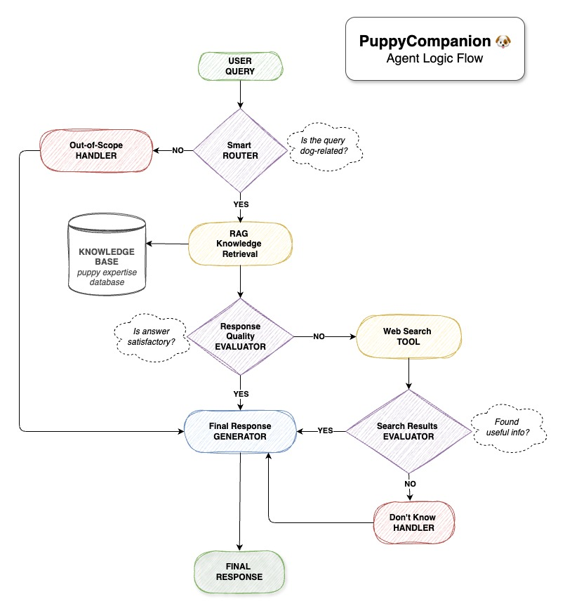

# Canine Assistant Project Structure

I've reorganized your application into a modular architecture with separate Python files for each functional component. Here's the project structure:

```
assistant_canin/
│
├── document_loader.py      # Loading and preparing PDF documents
├── embedding_models.py     # Classes for different embedding configurations
├── rag_system.py          # RAG system with prompt and LangChain graph
├── agent_workflow.py      # Agent workflow with routing logic
├── evaluation.py          # Evaluation functions with RAGAS
├── main_notebook.ipynb    # Main notebook for running the application
├── embedding_finetuning.ipynb # Notebook for embedding model fine-tuning
├── preprocess_chunks.ipynb    # Notebook for data preprocessing
│
├── doc/
│ ├── puppy-companion-simple-logic.jpg  # System logic diagram
│ └── Answers_AI_Certificationpdf.pdf   # Certification documentation
│
├── data/
│ └── BD_PuppiesForDummies.pdf # Source document
│
├── metrics/                # Directory for evaluation metrics
├── models/                # Directory for model artifacts
│
├── pyproject.toml         # Project dependencies and configuration
└── .env                   # Environment Variables File
```



## Module Descriptions

### 1. `document_loader.py`
Ce module contient les fonctions pour charger et prétraiter les documents PDF :
- `load_document_with_unstructured()`: Charge un PDF avec Unstructured.io
- `split_document_with_unstructured()`: Divise les documents en chunks avec un chevauchement contrôlé

### 2. `embedding_models.py`
Ce module définit une hiérarchie de classes pour les différents modèles d'embedding :
- `EmbeddingModelBase`: Classe de base abstraite
- `OpenAIEmbeddingModel`: Modèle OpenAI standard
- `OpenAIWithCohereRerankModel`: Modèle OpenAI avec reranking Cohere
- `SnowflakeArcticEmbedModel`: Modèle Snowflake Arctic sans fine-tuning
- `SnowflakeArcticEmbedFineTunedModel`: Modèle Snowflake Arctic fine-tuné

### 3. `rag_system.py`
Ce module implémente le système RAG principal :
- `RAGSystem`: Classe pour créer et gérer le graphe RAG
- `State`: TypedDict pour l'état du graphe RAG
- `RAG_PROMPT`: Template de prompt pour les réponses

### 4. `agent_workflow.py`
Ce module gère le workflow complet de l'agent intelligent :
- `AgentWorkflow`: Classe principale pour orchestrer le workflow
- `AgentState`: TypedDict pour l'état du workflow
- Nodes pour le routage, la détection de domaine et la génération de réponses

### 5. `evaluation.py`
Ce module fournit les outils d'évaluation :
- `CanineAppParser`: Pour extraire le contexte et les réponses
- `CanineTestsetGenerator`: Pour générer des jeux de test spécialisés
- `DomainDetectionAccuracy`: Métrique personnalisée pour évaluer la détection de domaine
- `CanineApplicationEvaluator`: Pour exécuter l'évaluation complète
- `compare_embedding_models()`: Pour comparer différentes configurations

### 6. Notebooks
- `main_notebook.ipynb`: Notebook principal pour exécuter l'application
- `embedding_finetuning.ipynb`: Pour le fine-tuning des modèles d'embedding
- `preprocess_chunks.ipynb`: Pour le prétraitement des données

## Améliorations

1. **Organisation modulaire**: Le code est organisé en modules cohérents avec des responsabilités claires
2. **Interfaces abstraites**: L'utilisation de classes abstraites facilite l'ajout de nouvelles configurations d'embedding
3. **Flexibilité d'évaluation**: Le système d'évaluation peut facilement comparer différentes configurations
4. **Approche étape par étape**: Les notebooks guident l'utilisateur à travers les étapes de configuration et d'évaluation
5. **Meilleure séparation des préoccupations**: Chaque module se concentre sur une tâche spécifique

## Prérequis système

Pour exécuter ce projet, vous avez besoin de :
1. Python 3.9+
2. Les bibliothèques listées dans pyproject.toml
3. Un fichier `.env` avec au minimum :
```
OPENAI_API_KEY = your_openai_key
COHERE_API_KEY = your_cohere_key (optionnel pour le reranking)
```
4. Le fichier PDF "Puppies For Dummies" dans le dossier `data/`